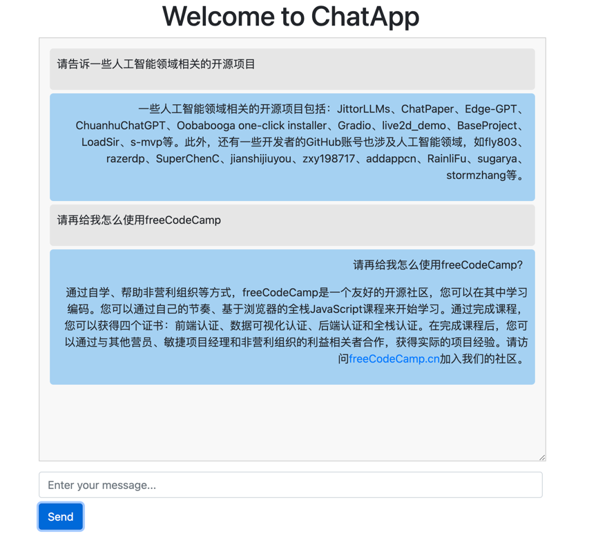

# OSS_CHAT
OSS_Chat is a chat tool designed for training domain knowledge. 

OSS_Chat aims to become the most comprehensive Q&A tool for knowledge in the open-source field.
## Function
Can talk with the chat, As follows:


## Directory Structure
```
OSS_Chat
│ .idea
│ app
│ ├── data # Storage directory for training data
│ ├── temelate # the template directory
│ babel
│ .gitignore
│ config.py
│ config.py.tpl
│ README.md
│ requirements.txt
│ run.py
```

- `app/data`: Storage directory for training data. If anyone wants to add other data, please update it in this directory.
- `app`: Contains the main code and resources for the application.
- `babel`: Configuration for internationalization and localization.
- `config.py`: Configuration file for the application.
- `requirements.txt`: List of project dependencies.

## Installation

### Prerequisites

- Python 3.x
- Other necessary dependencies (can be installed from the project root directory by running `pip install -r requirements.txt`)

### Installation Steps

1. Clone this repository:

   ```bash
   git clone https://github.com/bifenglin/OSS_Chat.git
    ```
2. Navigate to the project directory:

   ```bash
   cd OSS_Chat
   ```
3. Install the project dependencies:

   ```bash
    pip install -r requirements.txt
    ```

### Usage

1. Run the application:

   ```bash
   python run.py
   ```
   
2. Open the browser and enter the URL: http://localhost:port (port is the port number of the application, the default is 8080)


## Contributing
If you are interested in contributing to OSS_Chat, please feel free to submit a Pull Request or create an Issue.

## License
This project is licensed under the MIT License. See the LICENSE file for details.

## Contact 
For any questions or suggestions, please contact us through:

Email: 515186469@qq.com
GitHub Issues

## Acknowledgments
Special thanks to all the contributors to this project and to everyone contributing to the open-source community.
